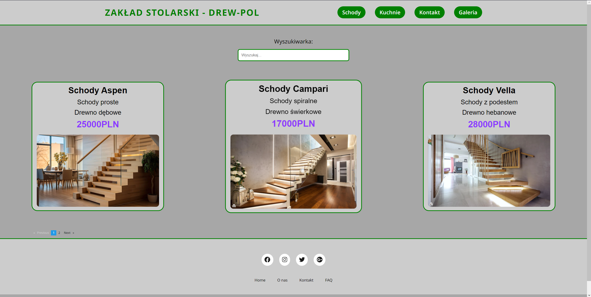
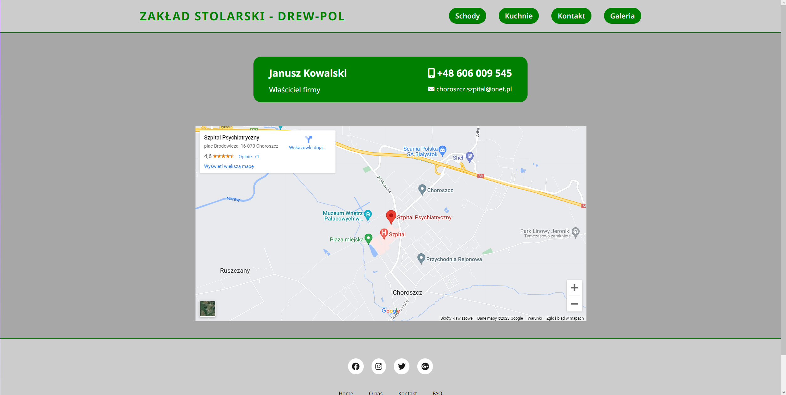
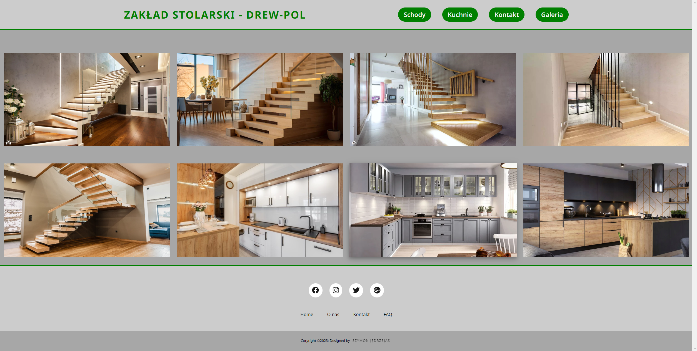

# Zakład Stolarski - DREW-POL

### 1. Autor projektu - Szymon Jędrzejas

### 2. Strona internetowa wykonana z użyciem technologii Angular. Posiada 4 podstrony. Na dwóch pierwszych zastosowałem paginacje z użyciem <em>ngx-pagination</em> oraz dodałem search bar z użyciem <em>ng2-search-filter</em>

### 3. Wspomagałem się dokumentacją oraz losowymi tutorialami z YouTuba

## Galeria 

### Podstrona <em>Schody</em>

### Podstrona <em>Kontakt</em>

### Podstrona <em>Galeria</em>

### <em>Wygląd galerii</em>

